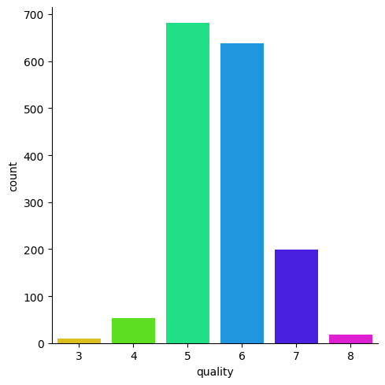
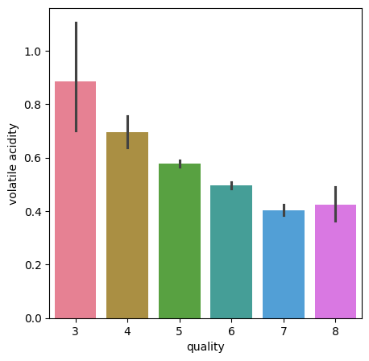
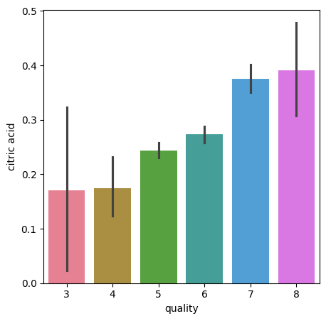
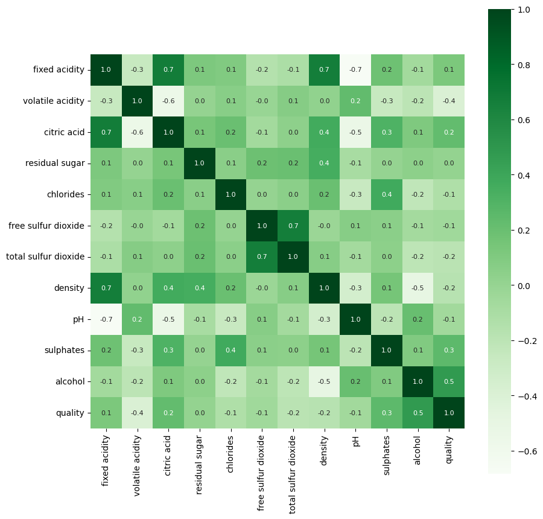
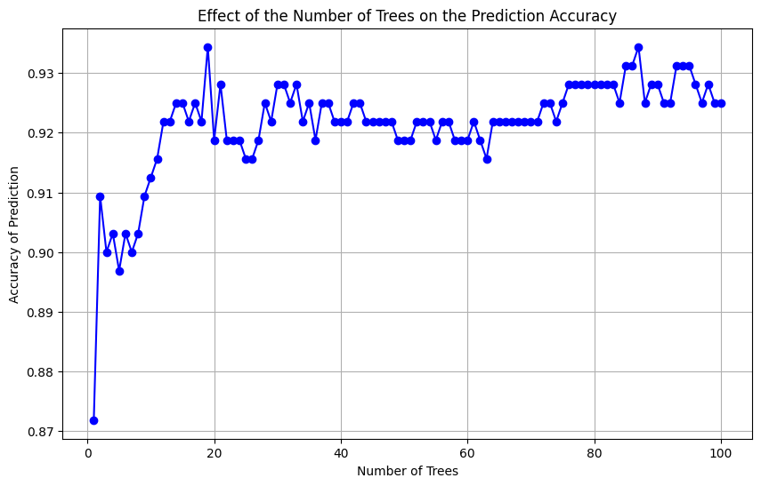

### 1. **Repository Structure**

```
Wine-Quality-Prediction/
│
├── README.md
├── wineQuality.ipynb
├── pairplot.png
├── heatmap.png
└── accuracy_plot.png
```

### 2. **`ReadMe.md`**

# Wine Quality Prediction and Visualization

This project analyzes the Wine Quality dataset using various data visualization techniques like Seaborn plots and heatmaps. It also explores how the number of trees in a Random Forest model affects prediction accuracy.

## Installation

1. Clone the repository:
   ```
   git clone https://github.com/Madhusudan0626/Wine_Quality_Prediction_Visualization
   ```
2. Install the required dependencies:
   ```
   pip install numpy pandas matplotlib seaborn scikit-learn
   ```
3. Run the notebook:
   ```
   jupyter notebook wineQuality.ipynb
   ```

### Data Visualization

This project includes the following visualizations:

### Pairplot




### Heatmap


## Random Forest Model Analysis

The project evaluates the effect of the number of trees in a Random Forest model on the prediction accuracy.

### Accuracy vs Number of Trees


## Usage

To explore the visualizations and experiment with the Random Forest model:

1. Open the Jupyter notebook `wineQuality.ipynb`.
2. Run the notebook step-by-step to generate the plots and results.

## Conclusion

This project highlights the power of data visualization in understanding the relationships between features in the dataset. It also demonstrates how model tuning (number of trees in a Random Forest) can improve prediction accuracy.


### 4. **Notebook and Images**

- Ensure your `wineQuality.ipynb` notebook includes the code for data analysis, visualizations, and Random Forest model evaluation.
- Save the images for the pairplot, heatmap, and accuracy vs number of trees as described in the previous step.

### 5. **Push to GitHub**

1. Create a new repository on GitHub.
2. Clone the repository to your local machine.
3. Add all the files:

   ```
   git add README.md wineQuality.ipynb pairplot1.png pairplot2.png pairplot3.png heatmap.png accuracy_of_prediction.png
   git commit -m "Initial commit with project files"
   git push origin main
   ```

Let me know if you need any further assistance!
